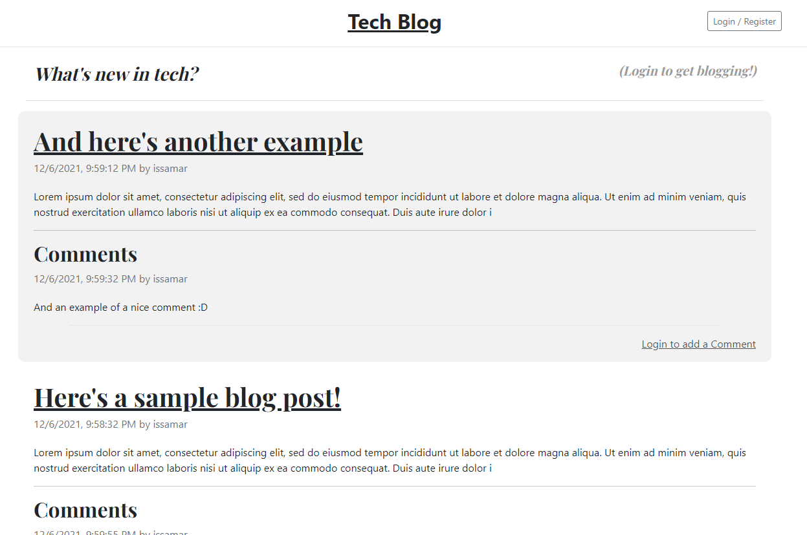
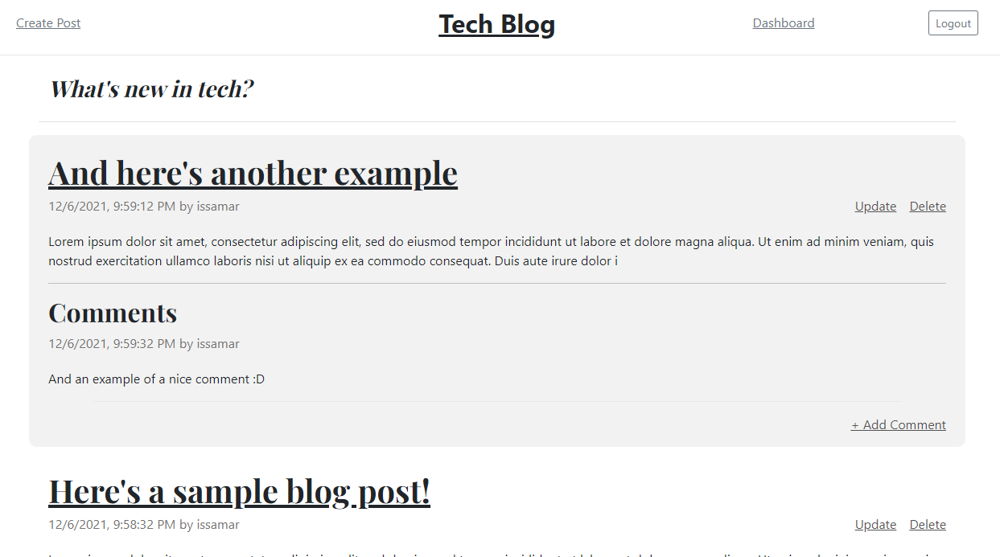

# simple-tech-blog
The simple tech blog is exactly that. A space where people can create a profile and start blogging about tech! It was also an exercise in working with routes, connecting front-end JS to routes, and getting some more practice with Sequelize.

## What was the Point?
To give a place for people to go and blog about tech. But other than that, giving me some more practice to build out a basic full-stack application and get it deployed.

## Lessons Learned
It was a great exercise connecting the front-end to the back-end as well as starting a web app from scratch by myself.

## Improvements
I had some issues with ordering the posts and the comments which I would love to resolve in the future. Aside from that, potentially flesh out a profile page and add some more functionality there.

## Deployed Link
Check out the deployed app here: https://intense-castle-95951.herokuapp.com/

## Screenshots

